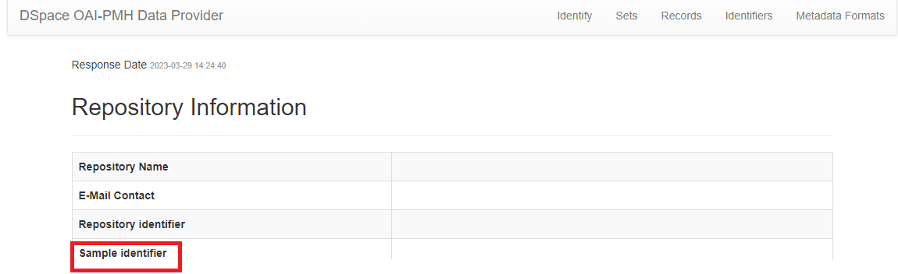

# Lareferencia-widget-embed

This library was generated with [Angular CLI](https://github.com/angular/angular-cli) version 15.2.0.

## Instalar en dSPACE

Run `npm install lareferencia-widget-embed`
> Note: Si ves errores de dependencias puedes usar `npm install lareferencia-widget-embed --force` o intentar arreglar los errores, esta libreria solo tiene como dependecias angular/core, cualquier otro error probablemente sea de dSPACE por lo cual recomendamos utilizar --force en este caso.

## Utilizar lareferencia-widget-embed.

Importar el modulo "LareferenciaWidgetEmbedModule" en tu proyecto dSPACE, recomendamos importarlo en la carpeta "shared" del proyecto dSPACE 
"src/app/shared/shared.module.ts" de esta forma:

```
import { lareferenciaWidgetEmbedModule } from 'lareferencia-widget-embed';

const MODULES = [
  //Otros modulos...
  lareferenciaWidgetEmbedModule,
];

@NgModule({
  imports: [
    ...MODULES,
    ...ROOT_MODULES,
  ],
```

De esta forma podras utilizar el componente
```<lib-lareferencia-widget-embed></lib-lareferencia-widget-embed>``` 
en cualquier lugar donde estes importanto el modulo "SharedModule". Dicho componente debe ser colocado en los archivos .html, por ejemplo:

en "src/app/item-page/simple/item-types/publication/publication.component.html"
```
    <ds-generic-item-page-field [item]="object"
      [fields]="['dc.publisher']"
      [label]="'publication.page.publisher'">
    </ds-generic-item-page-field>

    <lib-lareferencia-widget-embed></lib-lareferencia-widget-embed>
    
  </div>
  <div>
```

## Elegir el widget

Debes elegir el widget utilizando [widgetType] en el componente, de momento solo puedes utilizar:
1. 'lrw'

Por ejemplo 
```
<lib-lareferencia-widget-embed [widgetType]="'lrw'"></lib-lareferencia-widget-embed>
```
Puedes utilizar mas de uno, de esta forma:

```
<lib-lareferencia-widget-embed [widgetType]="'lrw'"></lib-lareferencia-widget-embed>
<lib-lareferencia-widget-embed [widgetType]="'widget'"></lib-lareferencia-widget-embed>
```

## Configurar el o los widgets

En la carpeta "assets", necesitas crear (si no la tienes) una carpeta "data", alli deberas descargar y colocar el archivo "widget.config.json"

Descargar el archivo "widget.config.json" que se encuentra dentro de src/assets/data.
[Descargar widget.config.json](/src/assets/data/widget.config.json)


# lrw widget

- Configurar parametros en widget.config.json 
> Nota: Para configurar este widget debes editar unicamente los parametros dentro del objeto "lrw"

```
{
    "lareferencia-widgets": {

        "lrw": { 
            "active": true,
            
            //Reemplazar lrw@x.y.z de ser necesario
            "widget_url": "https://cdn.jsdelivr.net/gh/lareferencia/lrw@1.1.5/dist/lrw.js", 
            
            "parameters":{
                "widget_div_id": "usage-stats", //no modificar

                "identifier_prefix": "",
                "identifier_regex": "",

                "event_labels": {   
                    "view": "[[Vistas]]",
                    "download": "[[Descargas]]",
                    "outlink": "[[Enlaces]]"
                },
                "scope_labels": {
                    "L": "[[LA Referencia]]",
                    "N": "[[Nombre nodo nacional]]",
                    "R": "[[Nombre repositorio]]"
                },
                "country": "[[country]]",
                "national_source": "[[SITEID::59]]",
                "repository_source": "[[OPENDOAR::1329]]"
            }
        }
    }
}
```

- El parametro "widget_url" contiene la url, donde debera ir la ultima version.
La version tiene la forma X.Y.Z y debe ser actualizada en el parametro "widget_url"
`Por ejemplo "cdn.jsdelivr.net/gh/lareferencia/lrw@X.Y.Z/dist/lrw.js" reemplazando X.Y.Z`

- Donde se muestra [[expresion]] reemplazar quitando los [[]].
  
- Nombre del nodo nacional:
Nombre que aparecerá describiendo los eventos provenientes del nodo nacional. Esto debe ser indicado por el gestor del nodo nacional.

- Nombre del repositorio:
Nombre que aparecerá describiendo los eventos del repositorio, debe ser corto para evitar problemas de visualización.

- country:
ISO dos digitos del país de repositorio. Ejemplos: AR,BR,ES,UY

- nacional_source:
Identificador del agregador regional, debe consultar esta lista para obtenerlos. Listado de identificadores de nodos nacionales

- repository_source:
Identificador del repositorio, se forma con el prefijo OPENDOAR:: concatenado con el número identificatorio en OpenDOAR. Ejemplo: OPENDOAR::1234

- item oai identifier:

Para construir el oai identifier a partir de la URL del item en DSpace, se requieren dos variables: identifier_prefix y identifier_regex.

La variable identifier_prefix corresponde a la forma en que DSpace está configurado para generar los oai identifiers. Este valor puede consultarlo en el archivo /config/modules/oai.cfg en la variable oai.identifier.prefix.

También es posible consultar este valor en la interfaz OAI, específicamente como resultado de la consulta Identifiy. En http://[[URL-DSpace]]/oai/request?verb=Identify puede observarse el "Sample identifier:



La variable identifier_regex corresponde a la expresión regular necesaria para obtener el consecutivo del ítem a patir de la URL. De manera que si la URL tiene la forma:

https://www.kerwa.ucr.ac.cr/handle/10669/12345

A partir de ella debe extraerse el número consecutivo correspondiente el item (12345). Este número se concatenará a la variable identifier_prefix. Los valores de las variables utilizadas por el script deben ser los siguientes:

`identifier_prefix: 'oai:https://www.kerwa.ucr.ac.cr:10669/',
identifier_regex: '\/handle\/[0-9\.]+\/([0-9]+)\/?',`